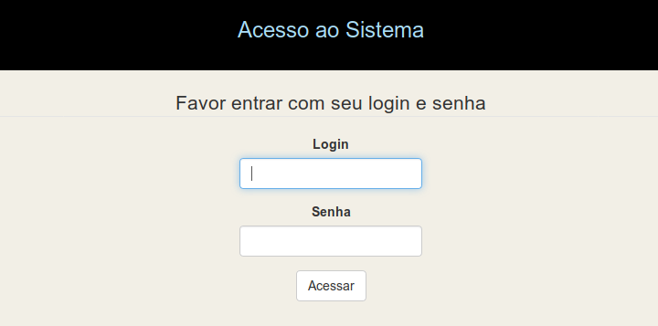

## Guia para instalação no Linux

Chamarei o aplicativo de clientes e suporei a instalação em:

```php
Em
/var/www/html/clientes

Ajuste caso esteja instalando em outro diretório.
```

### Criar um banco de dados chamado cliente para testes iniciais

### Instalação do CakePHP 3 (Atualmente sem suporte ao Cake 4)

```php
cd /var/www/html ou cd c:\xampp\htdocs
composer create-project --prefer-dist cakephp/app:~3. clientes
```
Edite o composer.json criado e remova a linha com postAutoloadDump, somente se estiver usando composer 2      

## Instalação do Plugin
```php
cd clientes
composer require ribafs/admin-br
```
## Habilitar o Plugin
```php
bin/cake plugin load AdminBr --bootstrap 
```
## Pequena correção no PaginatorHelper
Até a versão 1.25 havia um pequneo problema na paginação, ficando com uma quebra de linha.
Acontece que o colega https://github.com/eduardoves me mandou as recomendações para corrigir e agora tá beleza

Acesse a pasta onde instalou o Cake e edite o arquivo:
vendor/friendsofcake/bootstrap-ui/src/View/Helper/PaginatorHelper.php
Então comente as linhas seguintes:
59, 69, 70 e 71
Obrigado Eduardo. :)

## Configurações

Banco de dados – config/app.php, configure user, senha e banco:
```php
            'username' => 'root',
            'password' => 'root',
            'database' => 'cliente',

Em 'Error' =>
Troque - 'errorLevel' => E_ALL,
por
'errorLevel' => E_ALL & ~E_USER_DEPRECATED & E_USER_NOTICE,
```

Rotas – config/routes.php, comente esta linha abaixo:
```php
    //$routes->connect('/pages/*', ['controller' => 'Pages', 'action' => 'display']);
E adicione esta:

    $routes->connect('/', ['controller' => 'Users', 'action' => 'login']);
```    
## Executar o composer update no plugin
```php
cd /var/www/html/clientes
composer dump-autoload -d vendor/ribafs/admin-br 
```
## Execute a migration
```php
cd /var/www/html/clientes 
bin/cake migrations migrate -p AdminBr
bin/cake migrations seed -p AdminBr
```
## Geração do Código com o bake
```php

cd clientes
bin/cake bake all groups -t AdminBr
bin/cake bake all users -t AdminBr
bin/cake bake all permissions -t AdminBr
bin/cake bake all customers -t AdminBr
```
## Testes de uso do aplicativo

http://localhost/clientes

Ao abrir no navegador vemos:



Existem 4 usuários cadastrados:
```php
super – manda chuva, pode tudo
admin – somente pode tudo nas tabelas administrativas: users, groups e permissions
manager – pode tudo somente na tabela customers
user – não pode nada, somente logar. Requer liberação de permissões
```
Obs.: a senha de cada um é esta:
```php
super – abc123S@
admin – abc123A@
manager – abc123M@
user – abc123U@
```

Observe que as senhas tem um padrão para facilitar a memorização:

- Parte fixa para todos – abc123
- Primeira letra do login em maiúscula
- Todos finalizam com @

## Mais Detalhes?

Veja o tutorial para customização do aplicativo com mais informações:

https://github.com/ribafs/admin-br/blob/master/TUTORIAL.md
