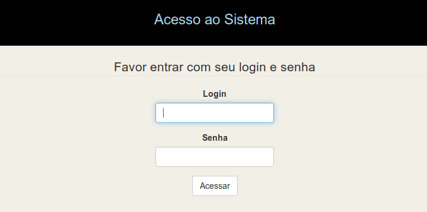

# Implementando ACL no CakePHP 3 com interface web

## Testado com até a versão 3.7.7 do CakePHP.

### Este plugin continua o cake-acl-br

Idealmente instale em um ambiente de testes para ter maior controle.

URL deste projeto - https://github.com/ribafs/admin-br/

Este plugin inclue o plugin [BootstrapUI](https://github.com/friendsofcake/bootstrap-ui) e o Twitter Bootstrap e também inclui os templates do bake do plugin [twbs-cake-plugin](https://github.com/elboletaire/twbs-cake-plugin) aos autores dos quais gostaria de agradecer.

## Principais recursos    
    • Menu de topo com o element topmenu 
    • Uso do framework Bootstrap
    • Busca com paginação 
    • Senhas criptografadas com Bcrypt 
    • Controle de Acesso tipo ACL com administração web 
    • Dois Layouts: admin e default com cor de fundo que os diferencia
    • Datas formatadas como pt-br (veja em Customers)
    • Tradução do template do Bake para pt-br
    • Customização do bootstrap_cli adicionando os campos login e logout na geração do Bake
    • Validação via frontend no login com pattern e minlenght, para exigir senha forte, com pelo menos 8 dígitos,     
    uma maiúscula, uma minúscula e um símbolo. Também com recomendações para validação semelhante pelo CakePHP no
    UsersTable.php

## Com esta versão temos validação no login
Agora temos validação pelo frontend usando recursos do HTML5, pattern e minlenght e também pelo UsersTable.php
    
## Criação de aplicativo usando o admin-br com bastante detalhes

Abaixo um guia passo a passo e com boas informações para customizar aplicativos do CakePHP 3.

Chamarei o aplicativo de clientes e suporei a instalação em:

```php
Linux - /var/www/html/clientes

Windows - c:\xampp\htdocs\clientes

Ajuste caso esteja instalando em outro diretório.
```

### Criar um banco de dados chamado cliente para testes iniciais

### Instalação do CakePHP 3

```php
cd /var/www/html ou cd c:\xampp\htdocs
composer create-project --prefer-dist cakephp/app clientes
cd clientes
```
## Instalação do Plugin
```php
composer require ribafs/admin-br
```
## Habilitar o Plugin
```php
bin/cake plugin load AdminBr --bootstrap 

(no windows troque bin/cake por bin\cake)
```
## Configurações

Banco de dados – config/app.pgp, configure user, senha e banco:
```php
            'username' => 'root',
            'password' => 'root',
            'database' => 'cliente',

Em 'Error' =>
Troque - 'errorLevel' => E_ALL,
por
 'errorLevel' => E_ALL & ~E_USER_DEPRECATED,
```

Rotas – config/routes.php, comente esta linha abaixo:
```php
    //$routes->connect('/pages/*', ['controller' => 'Pages', 'action' => 'display']);
E adicione esta:

    $routes->connect('/', ['controller' => 'Users', 'action' => 'login']);
```    
## Executar o composer update no plugin
```php
Linux:
composer update -d /var/www/html/clientes/vendor/ribafs/admin-br 

Windows: 
composer update -d c:\xampp\htdocs\clientes\vendor\ribafs\admin-br
```
## Execute a migration
```php
cd /var/www/html/clientes 
ou
cd c:\xampp\htdocs\clientes)

No windows mude para bin\cake:
bin/cake migrations migrate -p AdminBr
bin/cake migrations seed -p AdminBr
```

## Geração do Código com o bake
```php
No Windows troque a barra:

cd clientes
bin/cake bake all groups -t AdminBr
bin/cake bake all users -t AdminBr
bin/cake bake all permissions -t AdminBr
bin/cake bake all customers -t AdminBr
```
## Testes de uso do aplicativo

http://localhost/clientes

Ao abrir no navegador vemos:



Existem 4 usuários cadastrados:
```php
super – manda chuva, pode tudo
admin – somente pode tudo nas tabelas administrativas: users, groups e permissions
manager – pode tudo somente na tabela customers
user – não pode nada, somente logar. Requer liberação de permissões
```
Obs.: a senha de cada um é esta:
```php
super – abc123S@
admin – abc123A@
manager – abc123M@
user – abc123U@
```

Observe que as senhas tem um padrão para facilitar a memorização:

- Parte fixa para todos – abc123
- Primeira letra do login em maiúscula
- Todos finalizam com @

## Mais Detalhes?

Veja o tutorial para customização do aplicativo com mais informações:

https://github.com/ribafs/admin-br/blob/master/TUTORIAL.md


## Sugestões, colaborações, issues, pull requests e forks serão muto bem vindos:

- Português
- PHP
- CakePHP
- ControlComponent.php
- Ou algo que queira me avisar...

License
-------

The MIT License (MIT)
