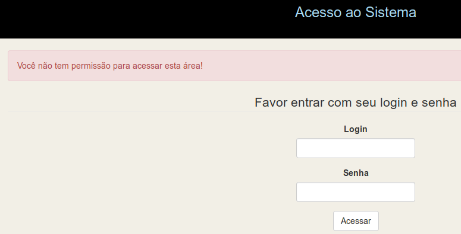

# Implementação de ACL no CakePHP 3 com interface web

## Testado com até a versão 3.7.7 do CakePHP.

### Este plugin continua o cake-acl-br

Idealmente instale em um ambiente de testes para ter maior controle.

URL deste projeto - https://github.com/ribafs/admin-br/

Este plugin inclue o plugin BootstrapUI e o (Twitter) Bootstrap e também inclui os templates do bake do plugin [twbs-cake-plugin](https://github.com/elboletaire/twbs-cake-plugin) aos autores dos quais gostaria de agradecer.

## Principais recursos    
    • Menu de topo com o element topmenu 
    • Uso do framework Bootstrap
    • Busca com paginação 
    • Senhas criptografadas com Bcrypt 
    • Controle de Acesso tipo ACL com administração web 
    • Dois Layouts: admin e default com cor de fundo que os diferencia
    • Datas formatadas como pt-br (veja em Customers)
    • Tradução do template do Bake para pt-br
    • Customização do bootstrap_cli adicionando os campos login e logout na geração do Bake
    • Validação via frontend no login com pattern e minlenght, para exigir senha forte, com pelo menos 8 dígitos,     
    uma maiúscula, uma minúscula e um símbolo. Também com recomendações para validação semelhante pelo CakePHP no
    UsersTable.php

## Com esta versão temos validação no login
Agora temos validação pelo frontend usando recursos do HTML5, pattern e minlenght e também pelo UsersTable.php
    
## Criação de aplicativo usando o admin-br com bastante detalhes

Abaixo um guia passo a passo e com boas informações para customizar aplicativos do CakePHP 3.

Chamarei o aplicativo de clientes

### Criar um banco de dados chamado cliente para testes iniciais

### Instalação do CakePHP 3

```php
cd /var/www/html ou cd c:\xampp\htdocs
composer create-project --prefer-dist cakephp/app clientes
cd clientes
```
## Instalação do Plugin
```php
composer require ribafs/admin-br
```
## Habilitar o Plugin
```php
bin/cake plugin load AdminBr --bootstrap (no windows troque a barra / por \)
```
## Configurações

Banco de dados – config/app.pgp, configure user, senha e banco:
```php
            'username' => 'root',
            'password' => 'root',
            'database' => 'cliente',

Em 'Error' =>
Troque - 'errorLevel' => E_ALL,
por
 'errorLevel' => E_ALL & ~E_USER_DEPRECATED,
```

Rotas – config/routes.php, comente esta linha abaixo:
```php
    //$routes->connect('/pages/*', ['controller' => 'Pages', 'action' => 'display']);
E adicione esta:

    $routes->connect('/', ['controller' => 'Users', 'action' => 'login']);
```    

## Efetue o download do plugin do GitHub

https://github.com/ribafs/admin-br

Descompacte e copie estes dois arquivos da pasta descompactada:
```php
No Linux:
copiar/bootstrap_cli.php /var/www/html/clientes/config (sobrescrevendo o existente)
copiar/AppController.php /var/www/html/clientes/src/Controller (sobrescrevendo o existente)

No windows:
copiar\bootstrap_cli.php c:\xampp\htdocs\clientes\config (sobrescrevendo o existente)
copiar\AppController.php c:\xampp\htdocs\clientes\src\Controller (sobrescrevendo o existente)
```
## Execute a migration
```php
No Windows troque a barra:

cd /var/www/html/clientes (ou cd c:\xampp\htdocs\clientes)
bin/cake migrations migrate (no windows mude para bin\cake)
bin/cake migrations seed
```

## Geração do Código com o bake
```php
No Windows troque a barra:

cd clientes
bin/cake bake all groups -t AdminBr
bin/cake bake all users -t AdminBr
bin/cake bake all permissions -t AdminBr
bin/cake bake all customers -t AdminBr
```
## Testes de uso do aplicativo

http://localhost/clientes

Ao abrir no navegador vemos:


Existem 4 usuários cadastrados:
```php
super – manda chuva, pode tudo
admin – somente pode tudo nas tabelas administrativas: users, groups e permissions
manager – pode tudo somente na tabela customers
user – não pode nada, somente logar. Requer liberação de permissões
```
Obs.: a senha de cada um é esta:
```php
super – abc123S@
admin – abc123A@
manager – abc123M@
user – abc123U@
```

Observe que as senhas tem um padrão para facilitar a memorização:

- Parte fixa para todos – abc123
- Primeira letra do login em maiúscula
- Todos finalizam com @

## Privilégios de cada usuário

Após efetuar login com cada um observe pelo menu a que ele tem acesso

## Após efetuar login com o usuário super aparece:


## Ao logar como admin vemos


Clicando em Sair e logando como manager:


## Finalmente logando como user:


Veja que ele está logado mas não tem permissão de acessar nada e foi jogado para a tela de login.

## Permissões

Para que ele enha acesso precisamos usar um dos usuários com privilégio administrativo para cadastrar permissões para ele. A tela de permissões é onde damos privilégios para usuários acessarem e efetuarem outras atividades.

## Concedendo permissão para o user acessar a index de customers

- Logar como admin
- Abrir permissions (por padrão ela será aberta)
- Clique à esquerda em Novo Permission
- Selecione em Group Users
- Em Controller digite Customers
- Em Action digite index

E clique em Enviar

## Testando a nova permissão

- Efetuar o login com user

Veja que agora ele acessa a tela de Customers


Observe que nem aparece o ícone para excluir um registro. Interessante as datas no formato pt-br

Como concedemos apenas permissão para listagem da index, ele não poderá acessar nem o edit nem o exibir.

Clique no botão com o lápis, para editar. Veja a mensagem em vermelho:


Como usuário user não tem permissão de acesso. Da mesma forma não tem para exibir.

## Usando nosso banco

Esta é uma instalação padrão de teste do plugin admin-br, que usa o banco default que acompanha o mesmo. Podemos adicionar nossas próprias tabelas ou usar nosso próprio banco, apenas precisamos adicionar as tabelas users, groups e permissions.


## Customizações do código gerado    

## Reforçando a segurança do login

## Reforçar através de recursos do HTML 5 o frontend

Edite src/Template/Users/login.ctp e altere o campo password para ter o seguinte código:
```php
<?= $this->Form->input('password',['label'=>'Senha', 'class'=>'col4', 'pattern'=>'^(?=.*[a-z])(?=.*[A-Z])(?=.*\d)(?=.*[@$!%*?&])[A-Za-z\d@$!%*?&]{8,}$', 'minlenght'=>8, 'title'=>'Favor digitar uma senha com pelo menos 8 dígitos, sendo pelo menos 1 algarismo, um minúsculo, um maiúsculo e um símbolo']) ?>
```
Então o código do  src/Template/Users/login.ctp ficará assim:

```php
<div class="users form">
<?= $this->Flash->render('auth') ?>    
    <div align="center">
        <?= $this->Form->create() ?>
        <fieldset>
            <legend><?= __('Favor entrar com seu login e senha') ?></legend>
            <?= $this->Form->input('username', ['label'=>'Login', 'class'=>'col4', 'autofocus'=>'true']) ?>
            <?php // $this->Form->input('password',['label'=>'Senha', 'class'=>'col4']) ?>
            <?= $this->Form->input('password',['label'=>'Senha', 'class'=>'col4', 'pattern'=>'^(?=.*[a-z])(?=.*[A-Z])(?=.*\d)(?=.*[@$!%*?&])[A-Za-z\d@$!%*?&]{8,}$', 'minlenght'=>8, 'title'=>'Favor digitar uma senha com pelo menos 8 dígitos, sendo pelo menos 1 algarismo, um minúsculo, um maiúsculo e um símbolo']) ?>
        </fieldset>
        <?= $this->Form->button(__('Acessar')); ?>
        <?= $this->Form->end() ?>
    </div>
</div>
```
Experimente logar agora com uma senha errada e verá a mensagem:

Atenda o formato solicitado:   Favor digitar uma senha com pelo menos 8 dígitos, sendo pelo menos 1 algarismo, um minúsculo, um maiúsculo e um símbolo.

## Reforçando a segurança no backend, usando validação

Edite o arquivo o src/Model/Table/UsersTable.php e adicione a validação para checar a senha com expressão regular. Mude o validator da password para que fique assim:

```php
        $validator
            ->scalar('password')
           // ->maxLength('password', 255)
            ->requirePresence('password', 'create')
            ->allowEmptyString('password', false)
            ->add('password', 'validFormat',[
                    'rule' => ['custom', '/^(?=.*[a-z])(?=.*[A-Z])(?=.*\d)(?=.*[@$!%*?&])[A-Za-z\d@$!%*?&]{8,}$/i'],
                    'message' => 'No mínimo 8 dígitos, sendo pelo menos uma minúscula, uma maiúscula e um símbolo.'
            ]);
```

Assim caso alguém acesse com um navegador sem suporte ao HTML5, o backend segurará, assim como se de alguma forma a validação do form for anulada ou falhar o backend segurará pela validação do model.

Só para testar vou retirar a validação do HTML5 para testar:



## Aterar a largura de campos nos forms.
Para isso usaremos as classes criadas no plugin admin-br para o framework Bootstrap, que estão no arquivo webroot/css/custom.css.


Veja como está o form add.ctp para adicionar nova permissão:


Os campos tem a largura da tela. Vamos reduzir adequadamente, usando a classe colX.

Ajustar a largura das colunas em src/Template/Permissions/add.ctp, para que fique assim:
```php
        <?php
            echo $this->Form->input('group_id', ['options' => $groups, 'autofocus'=>'true', 'class'=>'col4']);
            echo $this->Form->input('controller', ['class'=>'col4']);
            echo $this->Form->input('action',['class'=>'col4']);
        ?>
```

Veja agora como ficou:


Agora ficou mais adequado.

Aproveitar e ajustar também as larguras de src/Template/Permissions/edit.ctp

## Implementar a busca para Customers

Obs.: lembrar que busca é para campos tipo texto.

- Editar o arquivo src/Controller/PermissionsController.php

    - Remover o action index() ativo
    - Mover "use Cake\Datasource\ConnectionManager;" para baixo da linha "use App\Controller\AppController;"
    - Remover o final do comentário que está abaixo do index()

- Ajustar o index() que estava comentado para que fique assim, para que possamos pesquisar pelo group e pelo controller:

```php
    public function index()
    {        
		$conn = ConnectionManager::get('default');
		$driver = $conn->config()['driver']; // Outros: database, etc.
		
		if($driver == 'Cake\Database\Driver\Postgres'){
		    $this->paginate = [
		        //'contain' => ['Users'], // Quanto for relacionada com Users descomentar
		        'conditions' => ['or' => [
		            'Customers.name ilike' => '%' . $this->request->getQuery('search') . '%',
		            'Customers.phone ilike' => '%' . $this->request->getQuery('search') . '%'
		        ]],
		        'order' => ['Customers.id' => 'DESC' ]
		    ];
		}elseif($driver=='Cake\Database\Driver\Mysql'){
		    $this->paginate = [
		        //'contain' => ['Users'],
		        'conditions' => ['or' => [
		            'Customers.name like' => '%' . $this->request->getQuery('search') . '%',
		            'Customers.phone like' => '%' . $this->request->getQuery('search') . '%'
		        ]],
		        'order' => ['Customers.id' => 'DESC' ]
		    ];
		}else{
			print '<h2>Driver database dont supported!';
			exit;
		}
            
	        $this->set('customers', $this->paginate($this->Customers));
		$this->set('_serialize', ['customers']);    
    }
```
- Agora ajustemos o src/Template/Customers/index.ctp. Veja que o trecho de código da busca está comentado no início. Descomente e deixe assim:

```php
	<?php
	    echo $this->Form->create(null, ['type' => 'get']);
   	    echo $this->Form->label('Busca');
	    echo $this->Form->input('search', ['class' => 'form-control', 'label' => false, 'style'=>'width:170px;',
		'placeholder' => 'Nome ou fone', 'value' => $this->request->getQuery('search')]);	    
	    echo $this->Form->button('Busca');
	    echo $this->Form->end();
	?>            
```

- Agora já pode acessar novamente Customers e efetuar uma busca para testar. Veja como ficou:


Basta digitar as primeiras litras e clicar em Buscar.


## Mudar o Título do Aplicativo

Acessar clientes/src/Controller/AppController.php e alterar a linha:

        $this->set('titulo', 'Título do Aplicativo');

Para algo que desejar:

        $this->set('titulo', 'Cadastro de Clientes');


Acesse novamente e atualize a tela para visualizar o novo nome.


Vamos trocar  os tipos de campos controller e action do form src/Template/Permissions/add.ctp de text para select, já trazendo os respectivos actions

Acesse src/Template/Permissions/add.ctp e comente a linha do campo action e adicione esta abaixo:

```php			
            //echo $this->Form->input('action', ['class'=>'col4']);

            $options = ['index'=>'index','add'=>'add','edit'=>'edit','view'=>'view','delete'=>'delete'];
            echo $this->Form->input('action', ['options'=>$options,'required'=>'false', 'class'=>'col-md-12', 'empty'=>'Selecione','class'=>'col4']);
```

Controller apenas a sugestão, se fossem apenas os campos originais seria assim. Lembrando que para permissions somente estes controllers são válidos:

```php
            //echo $this->Form->input('controller', ['class'=>'col4']);

$options2 = ['Customers'=>'Customers','Groups'=>'Groups', 'Users'=>'Users', 'Permissions'=>'Permissions', 'Products'=>'Products', 'ProductItems'=>'ProductItems', 'value'=>'Selecione'];            
echo $this->Form->input('controller',['options'=>$options2,'required'=>'false', 'class'=>'col-md-12','empty'=>'Selecione','class'=>'col4']);
```


## Remover a coluna Password do src/Template/Users/index.ctp

Remover as linhas:

                <th><?= $this->Paginator->sort('password') ?></th>
e
                <td><?= h($user->password) ?></td>


Veja como ficou


## Adicionar 'Selecione' para a combo de User em add.ctp de todas as tabelas,

A linha deve ficar assim:

```php
 echo $this->Form->input('group_id', ['options' => $groups, 'autofocus'=>'true','empty'=>'Selecione', 'class'=>'col4']);
```

    
## Implantação do Aplicativo em Produção

Uma vez que seu aplicativo está completo, ou mesmo antes você pode querer implantá-lo. Há algumas coisas que você deve fazer quando da implantação de uma aplicação CakePHP. 

### Ajustes no config/app.php
- debug = false para ocultar as mensagens de erro
- mensagens de debug criadas com pr() e debug() são desabilitadas
- Erros de views são menos informativas e dão apenas uma mensagem de erro genérica
- Erros do PHP não são mostrados
- Exceções de pilha de exceção estão desativados.

### Cheque a Segurança
- Verifique se não deixou nenhum vazamento óbvio
- Habilite o componente Security
- Assegure-se de que seus Models têm regras de validação habilitadas

Use sempre os Helpers para reforçar a segurança

Ao criar forms sempre use o FormHelper
Ao criar Html procure sempre usar o HtmlHelper

Mais detalhes em:

http://book.cakephp.org/3.0/en/deployment.html


## Aplicativo de Exemplo usa no tutorial acima, pronto para testar:

https://github.com/ribafs/admin-br/raw/master/app-exemplo.zip

Algumas instruções no arquivo texto.

Detalhe: usa as senhas originais: super, admin, etc.

## Sugestões, colaborações e forks serão muto bem vindos:

- Português
- PHP
- CakePHP
- ControlComponent.php
- Ou algo que queira me avisar...

License
-------

The MIT License (MIT)
