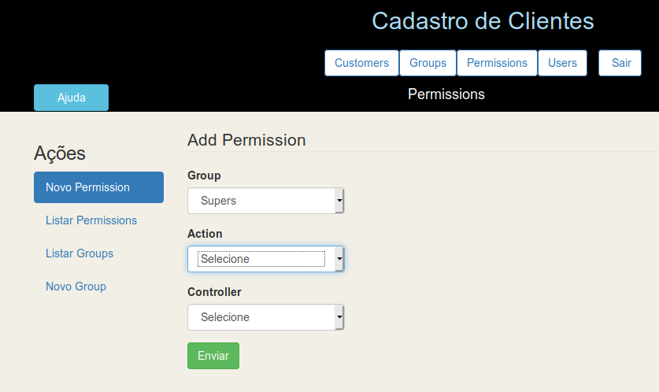
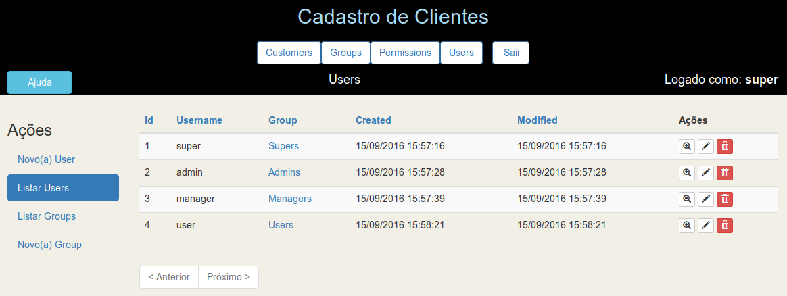

Continuação do README

Vamos trocar  os tipos de campos controller e action do form src/Template/Permissions/add.ctp de text para select, já trazendo os respectivos actions

Acesse src/Template/Permissions/add.ctp e comente a linha do campo action e adicione esta abaixo:

```php			
            //echo $this->Form->input('action', ['class'=>'col4']);

            $options = ['index'=>'index','add'=>'add','edit'=>'edit','view'=>'view','delete'=>'delete'];
            echo $this->Form->input('action', ['options'=>$options,'required'=>'false', 'class'=>'col-md-12', 'empty'=>'Selecione','class'=>'col4']);
```

Controller apenas a sugestão, se fossem apenas os campos originais seria assim. Lembrando que para permissions somente estes controllers são válidos:

```php
            //echo $this->Form->input('controller', ['class'=>'col4']);

$options2 = ['Customers'=>'Customers','Groups'=>'Groups', 'Users'=>'Users', 'Permissions'=>'Permissions', 'Products'=>'Products', 'ProductItems'=>'ProductItems', 'value'=>'Selecione'];            
echo $this->Form->input('controller',['options'=>$options2,'required'=>'false', 'class'=>'col-md-12','empty'=>'Selecione','class'=>'col4']);
```


## Remover a coluna Password do src/Template/Users/index.ctp

Remover as linhas:

                <th><?= $this->Paginator->sort('password') ?></th>
e
                <td><?= h($user->password) ?></td>


Veja como ficou



## Adicionar 'Selecione' para a combo de User em add.ctp de todas as tabelas,

A linha deve ficar assim:

```php
 echo $this->Form->input('group_id', ['options' => $groups, 'autofocus'=>'true','empty'=>'Selecione', 'class'=>'col4']);
```

    
## Implantação do Aplicativo em Produção

Uma vez que seu aplicativo está completo, ou mesmo antes você pode querer implantá-lo. Há algumas coisas que você deve fazer quando da implantação de uma aplicação CakePHP. 

### Ajustes no config/app.php
- debug = false para ocultar as mensagens de erro
- mensagens de debug criadas com pr() e debug() são desabilitadas
- Erros de views são menos informativas e dão apenas uma mensagem de erro genérica
- Erros do PHP não são mostrados
- Exceções de pilha de exceção estão desativados.

### Cheque a Segurança
- Verifique se não deixou nenhum vazamento óbvio
- Habilite o componente Security
- Assegure-se de que seus Models têm regras de validação habilitadas

Use sempre os Helpers para reforçar a segurança

Ao criar forms sempre use o FormHelper
Ao criar Html procure sempre usar o HtmlHelper

Mais detalhes em:

http://book.cakephp.org/3.0/en/deployment.html

## Ajuda para o aplicativo

Ao acessar o aplicativo, após o login, acima e à esquerda, encontrará um botão Ajuda, que poderá ser usado para dar algum aviso ao usuário ou então realmente oferecer ajuda. Para mudar seu texto altere em src/Tamplate/Layout/admin.ctp ou default.ctp no button com popover.
